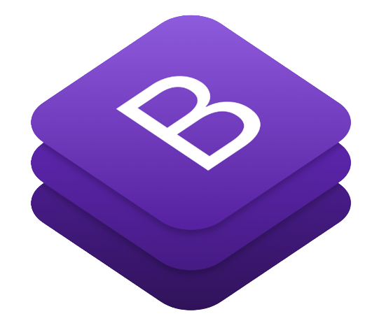

# Momature

## Submission for MT project

 

### About the project
Momature is a one-stop solution for all problems affecting pregnant women and mothers-to-be. We intend to provide a comprehensive solution for addressing small concerns from tracking appointments, reading blogs to getting relaxed by listening music.

## Table of contents
- [Technology Stack](#technology-stack)
- [Navigating through Website](#navigating-through-website) 
- [Useful links](#useful-links)
- [Resources used](#resources-used)

## Technology Stack

      

        
        
        
        
      

- HTML, CSS, Bootstrap and JavaScript were used for designing the frontend of the application.
 [(Back to top)](#table-of-contents)

## Navigating through Website
### Home Page

Home Page contains information about various sections of website like services, community, dashboard etc.

### Blogs

It contains blogs on various topics like exercise, diet, nutrition and parenting at one place for the ease of users.

### Music

This page is meant for providing relaxation and enjoyment to users. They can play various songs from the list as per their preference and need.

### Community

Community is meant for people to share their queries, journey with others and seek and provide help for people in need.

### Contact

Users can contact the Momature Team in case of queries by dropping the email and submitting the form.

 [(Back to top)](#table-of-contents)

## Useful Links
- [Deployed Website](https://LeanIn-Hacks.palakjain03.repl.co)
 [(Back to top)](#table-of-contents)

 [(Back to top)](#table-of-contents)

